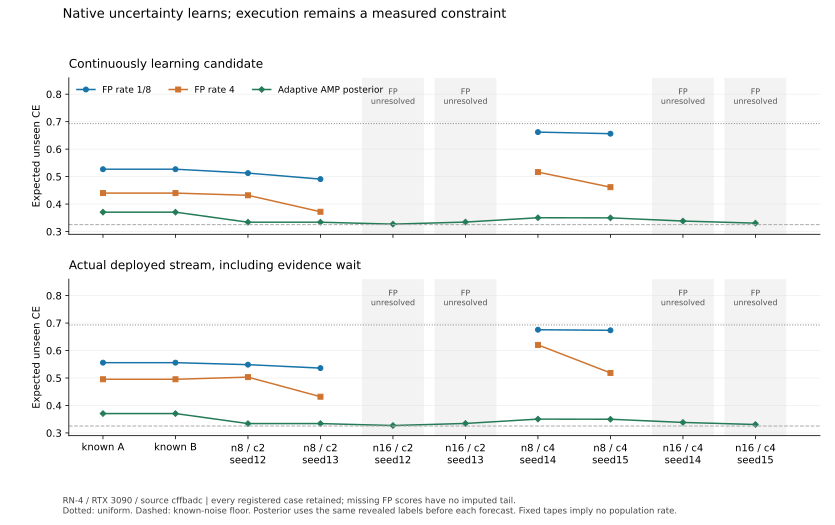

# RN-4: uncertainty learns, but relation propagation and execution still limit it

Status: **complete registered matrix, including eight unresolved FP runs**.
The [protocol](PROTOCOL.md) originated at `803cdc2`; its final metrics and
[runner](run_adaptive.py) were committed at
`cffbadcd5396ef18eb7a7bad094b0bcf8307a9e5` before target execution. The
[journal](../../evidence/minimal/FP_ADAPTIVE_UNCERTAINTY_EXPERIMENT.json)
retains all thirty workers from that source. Twelve n8 FP streams seal and
install; eight n16 FP streams halt unresolved at their first new prediction.
All ten strong adaptive posterior workers complete. No configuration is
changed, no failed tail is imputed and no target worker is rerun.

The balanced native learner improves on RN-3's fixed cross-component
uncertainty in both known worlds. On the new n8 two-/four-component samples,
rate4 candidate CE is0.401997/0.488960, versus the strong adaptive posterior's
0.334035/0.350041. The corresponding deployed scores are0.467520/0.569416.
Learning helps, yet useful propagation and deployment remain distinct issues.
The n16 outcomes supply no FP model-quality scores.

## Same-cut adaptive comparison

Each candidate forecast uses its actual continuously updated learner. The
posterior conditions on the identical revealed training and earlier
evaluation labels, including cycles; it forecasts before consuming the
current label. Both exact posterior and actual half-excess/single-normalized
predictions are recorded. The deployed FP stream includes the initial
uniform model and its real fresh-evidence/install boundary.

The primary unseen subset excludes diagonals and both directions of initial
training edges throughout evaluation. A later query in that subset may
already be inferable from earlier labels; it is not necessarily still an
unknown latent relation. All full-domain scores and raw single-division CE
also remain in the journal and independent analysis.

| Case group | FP candidate, rate1/8 | FP candidate, rate4 | Adaptive AMP posterior | FP deployed, rate1/8 | FP deployed, rate4 |
|---|---:|---:|---:|---:|---:|
| Known A | 0.526949 | 0.440025 | 0.370531 | 0.555822 | 0.495313 |
| Known B | 0.526949 | 0.440025 | 0.370531 | 0.555822 | 0.495313 |
| n8 / c2 / seeds12,13 | 0.501828 | 0.401997 | 0.334035 | 0.542259 | 0.467520 |
| n16 / c2 / seeds12,13 | Unresolved, 0/2 scored per rate | Unresolved, 0/2 | 0.330741 | Unresolved | Unresolved |
| n8 / c4 / seeds14,15 | 0.659139 | 0.488960 | 0.350041 | 0.674638 | 0.569416 |
| n16 / c4 / seeds14,15 | Unresolved, 0/2 scored per rate | Unresolved, 0/2 | 0.334428 | Unresolved | Unresolved |

IID rows are means of their two fixed seeds. Both rates were registered
before seeing them. Each n8 group scores and installs2/2 cases per rate;
all n16 attempts are retained in the denominator. These finite samples prove
no population success rate, dominance or family-level significance result.

For reference, the full-domain new n8 candidate means at rates1/8 and4 are
0.446595/0.377984 for c2 and0.575625/0.448009 for c4. Deployed means are
0.520400/0.463288 and0.641884/0.539980. The adaptive AMP posterior means are
0.331237 and0.343801. It completes the n16 domains too, with means0.329769
for c2 and0.332968 for c4.

The known worlds reuse v3's original journal at `2ca5b8a`, with worker
source `a351da9`, and the frozen posterior from RN-1's `4d04595` journal,
worker source `5b050c7`. Their counts, journal contents and device identity
are checked; neither frozen control is rerun. In both worlds v3's frozen CE
is0.592766 and deployed CE0.626226. RN-4's comparison changes the constructor,
learning rate, update cadence and declared range together; it does not
isolate the causal effect of one change. The new adaptive posterior is a
stronger information-matched control than the frozen posterior.

## Class bounds and fresh deployment stay separate

All ten data samples have strict, correct training-edge majorities, with no
ties; all twenty FP searches construct the available scale8 witness. The
empirical components match the observed support. This is a measured sample
property, not a structural recovery theorem or information supplied to FP.

The four conditioned diagnostic searches attain the independent categorical
upper and retain historical reference-class bounds. Their exact decision
class is fixed-state empirical CE over the registered full native grammar,
initializer/profile endpoints and actual baseline. This is neither adaptive
learner optimality nor an AMP/model-quality certificate. All sixteen IID
searches leave that full class `UNRESOLVED`. Eight of these later seal with
unresolved class decisions; the eight halted streams have no final closure.
Installing their continuously tested learners invents no training maximum.

Reference and AMP persistence are independently reconstructed from their
different actual forecast probabilities. Exact12-term log enclosures are
checked against256-digit Decimal, then exact grid16 lower wealth is stepped
and stopped at each path's first crossing. Dynamic near-neutral gains can
have enclosures narrower than100 digits, so the old fixed-score decimal
cross-check was insufficient; Runtime's exact arithmetic is unchanged.
Both paths cross at the same offsets in these twelve sealed runs, although
their wealth values differ. Unit1 permits immediate installation there.

| n8 case | Fresh offset, rate1/8 | Install cursor | Fresh offset, rate4 | Install cursor |
|---|---:|---:|---:|---:|
| Known A | 18 | 78 | 15 | 75 |
| Known B | 18 | 78 | 15 | 75 |
| c2 / seed12 | 25 | 85 | 24 | 84 |
| c2 / seed13 | 19 | 79 | 13 | 73 |
| c4 / seed14 | 42 | 82 | 34 | 74 |
| c4 / seed15 | 41 | 81 | 19 | 59 |

The c4 low-rate candidates improve only slowly; their actual deployment
stays close to uniform for much of the finite stream. Faster updates help
these tapes but still leave a gap to the adaptive posterior. Installation
counts alone do not measure that gap.

## The n16 boundary is prepaid phase evidence

Every n16 FP attempt constructs and compares its native candidate, admits
its separate fresh identities, then returns
`ResourceExceeded: actual CUDA phase evidence exceeds its prepaid frame`
on the first new prediction. The cursor is the training cutoff:140 for c2,
120 for c4. There is no installation or scored evaluation tail.

The fixed phase frame is131,072 bytes; it was not enlarged after failure.
This is an execution-envelope observation, not an intrinsic RTX3090 limit,
a graph-class exclusion, a numerical ordering theorem or a Foundation
counterexample. These workers explicitly retain
`UNRESOLVED_NUMERICAL_PHASE_RETAINED; NO_COMPLETE_ORACLE_CLAIM`.
No complete independent phase-count claim is assigned to their failed
prefixes. Source-bound jobs, terminal reasons and resource observations
remain in the journal. The full execution matrix is complete even though
these eight FP runs are unresolved.

## Research consequence: a nonzero gradient is not enough

The [transitive-learning proof](../../theory/proofs/TRANSITIVE_UNCERTAINTY_LEARNING.md)
constructs a controlled remaining obstruction. After labels on two edges
connecting three unknown component orientations, the exact next endpoint
prediction is189/250 toward their XOR. V4's independent component-pair
coefficients still give1/2 on that unqueried pair. A full **linear** mixture
of latent assignments can represent the missing correlation, yet additive
SGD also fails to generate its relation character while projection is
inactive. Representation alone therefore does not resolve this learner
obstacle.

An existing native self-PRODUCT supplies curvature and generates the path
moment under ordinary gradients. The local second-order propagation
coefficient is derived explicitly. Pure squared amplitudes also have an
absorbing zero; a native linear-plus-quadratic polynomial has a nonzero
recovery derivative there. Exact controls retain both the useful signal and
this failure. They do not establish that a larger constructor is owned,
fits RN-4's caps, implements a posterior or improves model risk. No RN-4
configuration is replaced by those controls.

The next model research must connect reachable joint-relation learning to
complete owned construction and a declared feasible execution envelope.
Keep the eight frame failures and the strong adaptive baseline. Reopen
Foundation only for a correctness counterexample; do not expand the frozen
static precision/resource cases to disguise solver or envelope limitations.

## Evidence and reproduction

`python -B experiments/adaptive_uncertainty/analyze_adaptive.py` independently
checks88 dynamic score records and twelve fresh decisions. `--plot`
regenerates the standalone SVG. `trajectory_oracle.py` checks936 full-graph
forecast/successor comparisons across exact forward differentiation,
binary64 and rounded AMP interpreters on synthetic fixtures, at both rates.
The baseline's incremental posterior has48 independent full-joint checks,
and post-analysis separately enumerates bit tuples and recomputes every
recorded dynamic posterior forecast and retained integer/work observation.
These analysis tools execute no new Runtime/GPU model worker.

The twelve sealed FP runs independently replay6,552 actual CUDA and6,552
binary64 phases; the ten new posterior workers word-check1,408 GPU forecasts.
The separate v4 endpoint matrices at `803cdc2` are not included in these
model counts. They are not another full baseline release.

Maximum completed-job commit is2,572,197,888 bytes, packed FP state81,202,893,
and consumed native extent720,560. The largest fully checked phase uses833
output cells and65,114 frame bytes. Observed checked CUDA maxima are
0.000747681 in state,0.00390625 in native masses/normalizers,0.000119088 in
normalized probabilities and2.98e-8 in division. These measured values are
separate from the preregistered1/100 state/probability tolerances.

The adaptive posterior retains at most5,305,770 direct integer-weight bytes,
with maximum weight/probability lengths1123/661 bits and51,249,152 counted
assignment visits. These are named payload/operation counts, not complete
heap or bit-time measurements; the completed4GiB jobs cover each process.
Its maximum native tensor/reservation observations are4096/2,097,152 bytes,
and its observed AMP mass-probability error is below9.764e-5.

Expected Brier is computed exactly per query, then enclosed on the fixed
48-bit dyadic grid and averaged. Every interval has width at most2^-48;
the maximum per-query Brier integer length is1320 bits. No giant accumulated
common denominator is retained. The149,430-byte journal and compact SVG
keep no datasets, weights, temporary preview or bulk phase histories.
Foundation R4, XVII.31, ERC-1 and the original correctness release stay frozen.
