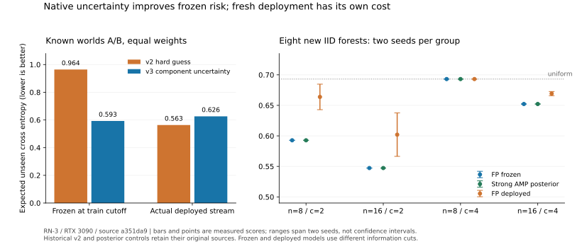

# RN-3: native uncertainty succeeds at a fixed cut and exposes a learning barrier

Status: **completed registered experiment; scoped empirical results and explicit proofs**.
The [protocol](PROTOCOL.md) was committed at `ad2c350`; the
[runner](run_study.py) and [data support](study.py) were committed at
`a351da95dafab6d06fb609c044f5fb0efbc09e74` before any target model execution.
The [journal](../../evidence/minimal/FP_COMPONENT_UNCERTAINTY_EXPERIMENT.json)
retains all eighteen new workers at that source, with no failed worker,
parameter change or rerun. Ten FP streams seal; nine install. All eight
new IID training classes stay `UNRESOLVED`. The two conditioned diagnostics
retain their actual historical categorical bounds.

The native component construction closes the known frozen-model uncertainty
failure: in both diagnostic worlds, its actual AMP prediction equals the
strong retained posterior and has unseen CE 0.592766. Their equal-world
frozen-model CE improves by 0.371510. Their **adaptive deployed** average
instead worsens, from 0.563488 to 0.626226. This possibility was explicit in
the protocol; model and deployment outcomes are reported at their actual
information cuts.

## What the native construction establishes

The [component proof](../../theory/proofs/COMPONENT_SYMMETRY_PROPOSAL.md)
averages the old hard predictions over the relative flips left unresolved
by consistent empirical constraints. On one-hot queries, within-component
relations keep their initialized confidence; across components the existing
positive base supplies uniform uncertainty. The graph uses only registered
sources, positive SUM/PRODUCT, and available unit/scale slots. It imports
no posterior coefficient, hidden component list or semantic architecture action.

The exact audit checks 7,320 prediction identities and 605 reachable scale
choices. CPU and RTX 3090 endpoint matrices separately pass at `ad2c350`,
including grammar refusal, tied constraints, actual installation and unequal
complete-learner continuations. Their six workers per path and 1,127 binary64
phases per path, plus1,127 CUDA phases, are **separate** from RN-3's model
counts below. The connected n=32 reference regression also passes.

All ten model samples have correct strict edge majorities and choose scale8.
The realized components equal the registered data-support components. Their
literal graph counts are `(2n+8c+2, 4c+2, 4c, 2n+12c, 2)` for nodes/SUMs/
PRODUCTs/edges/slots. The full native grammar and lookup competitors remain
in the optimization class. The eight unattained IID categorical uppers are
not converted into false completeness when their candidates install.

## Known worlds: frozen improvement, deployed reversal

The following controls retain their original worker sources: v2 FP at
`5bcbb49`, from the journal committed at `2f24d18`; the strong AMP posterior
at `5b050c7`, from the journal committed at `4d04595`. Their original content,
training counts and actual build/device identity are checked before reuse.
No unchanged control is rerun to obtain a new timestamp.

| World | v2 frozen | v3 frozen | AMP posterior | v2 deployed | v3 deployed |
|---|---:|---:|---:|---:|---:|
| A | 0.325083 | 0.592766 | 0.592766 | 0.433829 | 0.626226 |
| B | 1.603468 | 0.592766 | 0.592766 | 0.693147 | 0.626226 |
| Equal-world mean | 0.964276 | 0.592766 | 0.592766 | 0.563488 | 0.626226 |

The frozen improvement is exactly `(8/11) log(5/3)` under descriptive
binary64 CE evaluation. Both v3 worlds install at cursor80, twenty fresh
events after training; v2 installs only in A at 80. The old hard guess plus
fresh selection uses later labels to deploy selectively. Its deployed mean
can therefore beat a better fixed-cut uncertain candidate. This is not a
counterexample to conditional posterior optimality, and it proves no
population or deployed-algorithm dominance.

## Eight previously unexecuted IID forests

Each row is the mean over its two fixed seeds. Seeds8/9 have two components;
seeds10/11 have four. Candidate and posterior share the training cutoff;
the deployed column includes later evidence and initial uniform predictions.

| n | c | Installs | Frozen FP CE | Strong AMP posterior CE | FP deployed CE |
|---:|---:|---:|---:|---:|---:|
| 8 | 2 | 2/2 | 0.592766 | 0.592766 | 0.663869 |
| 16 | 2 | 2/2 | 0.547310 | 0.547310 | 0.601999 |
| 8 | 4 | 1/2 | 0.693147 | 0.693147 | 0.693147 |
| 16 | 4 | 2/2 | 0.652251 | 0.652256 | 0.669291 |

The primary unseen set excludes diagonals and both orientations of each
training edge. Across-component counts are32/44 for n=8,c=2,128/212 for
n=16,c=2,48/48 for n=8,c=4, and 192/216 for n=16,c=4. At the correctly recovered
scale8 endpoints, unseen CE is the weighted mean of H(1/10) within
components and log(2) across them. Exact expected Brier is respectively
227/550,989/2650,1/2 and 209/450. These follow from the measured predictions;
correct recovery in eight samples does not prove a population success rate.

Finite IID posterior uncertainty remains inside each component. The new
n=16,c=4 posterior mean is 0.652255790, compared with FP0.652251158. Favoring
the realized correct hard signs by a few millionths is not Bayes dominance
or exact posterior equivalence. The conditioned diagnostic's exact equality
must not be generalized to finite IID data.

Full-domain candidate CE is 0.509115 for two components and 0.601131 for four.
The full-domain deployed means for (n=8,c=2), (n=16,c=2), (n=8,c=4), (n=16,c=4) are
0.624135,0.580284,0.693147 and 0.637075. Full-domain predictions are retained
and independently checked, including the new baseline's exact/AMP scores.

## Fresh evidence is a finite resource

Offsets below count fresh events after training. The install cursor counts
all events. Neutral events are cross-component queries whose current
relative log gain against the uniform comparator is exactly zero.

| n / case / seed | First crossing offset | Install cursor | Events to install or end | Neutral events in that interval |
|---|---:|---:|---:|---:|
| 8 / disconnected-a / 0 | 20 | 80 | 20 | 9 |
| 8 / disconnected-b / 0 | 20 | 80 | 20 | 9 |
| 8 / iid-c2 / 8 | 41 | 110 | 50 | 25 |
| 8 / iid-c2 / 9 | 30 | 90 | 30 | 15 |
| 16 / iid-c2 / 8 | 21 | 170 | 30 | 11 |
| 16 / iid-c2 / 9 | 153 | 300 | 160 | 80 |
| 8 / iid-c4 / 10 | 56 | 100 | 60 | 44 |
| 8 / iid-c4 / 11 | None | None | 64 | 48 |
| 16 / iid-c4 / 10 | 106 | 230 | 110 | 82 |
| 16 / iid-c4 / 11 | 92 | 220 | 100 | 78 |

Independent replay checks log enclosures in100-digit Decimal, computes exact
dyadic wealth, stops each bet at its first crossing, and waits for a complete
unit 10 optimizer boundary. It reproduces every actual installation decision.
At n=16,c=2,seed9, the crossing at 153 follows63 positive,14 negative and 76
neutral scores; installation waits until160 fresh events. Correct training
recovery therefore does not imply quick fresh evidence on a realized tape.

The two n=8,c=4 cases are intentional information-limit controls. Every unseen
pair is cross-component, so FP and the posterior both correctly predict
uniform there. Seed10 crosses at 56 and installs at 60; its four remaining
queries are all cross-component. Even its full-domain deployed score stays
uniform despite a useful frozen full-domain candidate. Seed11 never crosses:
maximum wealth is 232785/65536 <4, and terminal wealth is 39891/16384. It seals
with `EVIDENCE` and no installation. This finite no-install outcome is not a
statistical rejection or a future continuation certificate.

## The remaining obstacle is learning from later information

A cross-component label has zero current comparison gain but can still
change a future conditional prediction. In the known diagnostic, the first
cross query is fresh event 2 and the next is event 4. Conditioned training
leaves four bit assignments, including the redundant global flips. Exact
enumeration using event 2's label, without event 4's target, changes the next
predictive probabilities to `(41/50,9/50)` in A and `(9/50,41/50)` in B.
The unchanged FP graph still predicts uniform. This is an **exact conditional
calculation**, not an executed adaptive posterior or an injected native value.

The [support argument](../../theory/proofs/COMPONENT_SYMMETRY_PROPOSAL.md)
shows why raising learning rate alone is insufficient. For a cross-component
one-hot query, each component-local PRODUCT has an identically zero factor.
Every evidence head and every current-label parameter derivative is zero
for all legal weights. Ordinary value updates in that fixed graph can never
change those uniform predictions, even if earlier optimizer history moves
its parameters. This is a proved limitation of the emitted graph, not an
exclusion of the native class or an implementation failure.

The next research target is a native reachable model that preserves current
uncertainty while retaining the ability to use later cross-component labels,
or an owned construction strategy that uses those retained labels. Equality
of initialized predictions does not imply equal future learners. Keep actual
complete-state/lineage/resource/freshness obligations and compare adaptive
models at equal information cuts, with a strong adaptive control. Do not
solve this by inserting fitted posterior coefficients or expanding static
precision/resource cases. Foundation R4, XVII.31 and ERC-1 remain frozen.

## Evidence and reproduction

`python -B experiments/component_uncertainty/analyze_study.py` independently
recomputes 72 new score records and ten prospective decisions. It also checks
the retained controls and exact conditional calculation without rerunning
any model. `--plot` regenerates the standalone figure; ranges span the two
fixed seeds and are not confidence intervals.

All 7,688 actual FP CUDA phases and 7,688 binary64 phases are independently
replayed. Eight separate posterior workers word-check 1,280 GPU forecasts.
Peak packed state is 196,491,241 bytes; consumed native extent is 1,242,336;
completed-job peak is 3,000,500,224. These fit the unchanged1GiB packed cap,
16 MiB arena and 4 GiB host job. Maximum phase output is 336 cells and 25,299
frame bytes, below 4,096/131,072. Physical-board 24GiB remains a separate
upper, not a process allocation or availability measurement.

The strong baseline's largest half table is 1,024 bytes, tensor peak11,264
and native allocator reservation2,097,152. Maximum exact **output** integer
size is 162 bits, not a measured maximum over all internal arithmetic.
Largest AMP stored-mass probability error is
`70532950049/1804805148268354`, about 3.91e-5. The actual RTX 3090 and Torch/
CUDA identity matches the original controls; resource observations are not
throughput, hardware-optimality or comparative implementation-efficiency claims.

The approximately83KB journal and 28 KB SVG contain no dataset, weights or bulk
phase history. The frozen 31-script baseline release retains its old source;
this solver extension and each model experiment retain their separate scopes.
