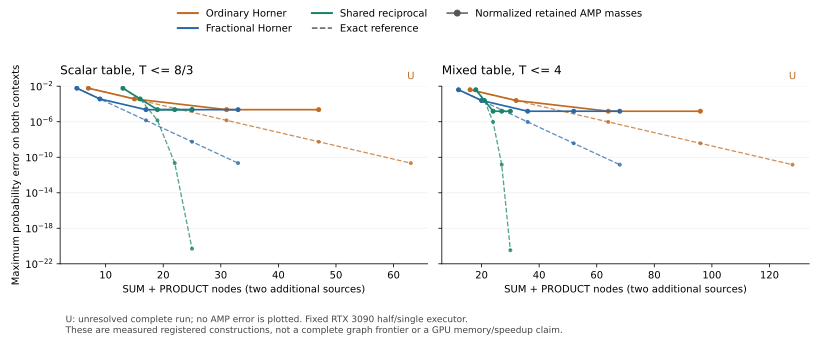

# ERC1-RTX3090-1: exact arithmetic compression meets the actual precision limit

**Completed, 2026-09-13. Empirical results on the registered executor.**
PRODUCT recurrence compresses the exact computation, but deeper recurrence
does not keep improving its half/single realization. On the mixed table it
reaches the best observed critical-cap AMP accuracy with fewer native nodes
and edges than the strong zero-PRODUCT baseline. On the scalar table it has
no such simultaneous advantage. These results preserve Foundation R4,
XVII.31, ERC-1 and the scoped Runtime freeze.

The [preregistered protocol](README.md) fixes 54 configurations of two
**known** tables, local coefficients (1/2, 1, 2), complete native Programs,
rate-zero learners with live gradients, and all caps before GPU execution.
[Minimal evidence](../../evidence/minimal/FP_ERC1_RTX3090_FRONTIER.json)
contains all outcomes and worker identities. The first 45 configurations
ran at `ef2357f`; the remaining nine ran at `c95ef5b` after an experiment
reporting correction. No scientific parameter or frozen Runtime code changed.

## 1. Critical-cap accuracy and real construction costs

Dashed curves are exact reference errors. Solid curves normalize the actual
retained single-precision masses using exact arithmetic. Raw final single
division has its own error, reported below and in the evidence. U labels
are outside the numerical curve: those runs did not complete.

The following configurations have the best observed AMP mass accuracy for
their critical-cap table. These are measured competitors, not an exhaustive
graph optimum. Sources are two additional nodes; every SUM edge and PRODUCT
incidence is counted.

| Table | Constructor | S | P | E | Retained-mass error | Consumed native extent, bytes |
|---|---|---:|---:|---:|---:|---:|
| scalar | Ordinary Horner, L=16 | 31 | 0 | 38 | 1/43688 | 46,840 |
| scalar | Fractional Horner, L=16 | 17 | 0 | 24 | 1/43688 | 31,096 |
| scalar | Reciprocal, n=3 | 12 | 7 | 30 | 1/43688 | 28,024 |
| mixed | Ordinary Horner, L=16 | 64 | 0 | 79 | 1/65532 | 114,536 |
| mixed | Fractional Horner, L=16 | 36 | 0 | 51 | 1/65532 | 75,336 |
| mixed | Reciprocal, n=3 | 17 | 7 | 38 | 1/65532 | 46,216 |

For scalar, the strong SUM control uses 17 operation nodes and 24 edges,
versus the reciprocal's 19 and 30. The reciprocal consumes slightly less
native arena extent; it does not dominate all coordinates. For mixed,
the reciprocal uses 24 operation nodes and 38 edges, versus 36 and 51,
and also consumes less native extent. Shared computation across different
coefficients matters in this measured example; the theorem's asymptotic
advantage alone does not settle either finite comparison.

At these points the exact errors are 1/699048 for scalar and 1/1048572
for mixed, for both L=16 and n=3. Increasing n from 3 to 5 improves each
exact error by more than **10^14**, reaching respectively
1/196765270119568550568 and 1/295147905179352825852. Actual retained-mass
errors remain exactly 1/43688 and 1/65532. The corresponding rounded-output
errors remain 3/131072 and 1537/100663296. No better target accuracy is
obtained by those extra PRODUCT/SUM nodes.

Fractional Horner remains usable at L=32. Ordinary Horner starts from a
half seed that underflows and subsequently amplifies it; it fails the
native prediction relation at L=32 in both tables. The strong control is
therefore essential to interpreting the reciprocal result. Its improved
behavior is a separately constructed Program, not a free rewrite of a
complete learner or an asserted parameter-response equivalence.

## 2. Exact reference prediction can be a worse physical choice

At larger registered slack, both exact singleton implementations work.
All three exact constructors have zero retained-mass error for scalar
n=1,2 and mixed n=2. The scalar raw predictions are also exact; the mixed
raw single divisions have error **1/100663296**, even when mathematical
normalization of the retained masses equals Q exactly.

At n=3 the reference-exact comparisons are:

| Table | Constructor | S / P / E | Actual complete-run result |
|---|---|---|---|
| scalar | Ordinary exact Horner | 46 / 0 / 56 | mass error 21/699016 |
| scalar | Fractional exact Horner | 32 / 0 / 42 | UNRESOLVED: rounded total exceeds cap |
| scalar | Positive tail repair | 20 / 10 / 48 | mass error 21/699016 |
| mixed | Ordinary exact Horner | 72 / 0 / 88 | mass error 23/524292 |
| mixed | Fractional exact Horner | 47 / 0 / 63 | UNRESOLVED: rounded total exceeds cap |
| mixed | Positive tail repair | 36 / 10 / 74 | mass error 31/1048532 |

The scalar case gives a small raw witness. Its cap is 10923/4096. Ordinary
Horner and tail repair retain masses `(3413/2048, 32769/32768)`, whose total
is below the cap by **7/32768**. Fractional Horner retains
`(1707/1024, 32769/32768)`, whose total exceeds it by **9/32768**. All three
graphs have exactly Q in the reference model. Avoiding small seeds does
not itself prove range safety under the registered operation schedule.

The critical-cap approximants above also satisfy every looser range cap.
They have **smaller actual errors** than these n=3 reference-exact
constructors. Thus this table is a comparison within the reference-exact
subset, not evidence that PRODUCT is necessary for useful physical accuracy.
Paying for exact reference probabilities can buy a worse target prediction.
Model experiments should compare actual feasible trajectories and costs.

Tail repair completes at the remaining smaller slacks, retaining the same
critical-cap AMP error floors. The tested exact Horner controls become
unresolved, but these finite failures are not a lower certificate against
other zero-PRODUCT Programs. No static search for an optimal half-specific
constructor is opened by this experiment.

## 3. The unresolved outcomes are part of the result

All **54** configurations have recorded worker results: **44** complete owned
streams and **10** `HALTED_UNRESOLVED` streams. Failure causes are:

| Cause | Configurations | What was actually checked |
|---|---:|---|
| Native prediction error | 4 | Both L=32 ordinary approximants and the smallest retained ordinary exact-Horner slack before the deeper mixed case; actual CUDA outputs independently replayed |
| Rounded normalizer exceeds cap | 4 | Exact fractional Horner at scalar/mixed n=3,4; these are CUDA failures, despite the shared checker saying `binary64` for its widened representation |
| Prepaid phase evidence exhausted | 1 | Mixed exact Horner n=5: attempted frame 138,136 bytes > 131,072; only the paid admission marker remains as packed evidence |
| Exact sum of stored masses exceeds cap | 1 | Mixed exact fractional Horner n=5: the actual **CPU binary64** branch fails before CUDA executes the second context |

The experiment reporter initially assumed every diagnostic CUDA record
had a full packed frame. The natural evidence-cap failure disproved that
reporter assumption, not the Runtime's already audited failure behavior.
The correction explicitly checks the admitted marker, attempted frame size,
unresolved status and retained raw diagnostics. The failed reporting worker
was rerun; the prior 45 completed worker results were preserved. No cap,
tolerance, constructor or protocol was adjusted to get a successful run.

The 54 recorded results contain **2,133 independently replayed CUDA outputs**: 2,124 checked
phases and nine failed diagnostic outputs. There are **2,134 independently
replayed binary64 outputs**: 2,133 checked and one failed. The actual
reference trajectories contribute **828** independently checked events.
The result verifier also compares exact reverse gradients with independent
forward differentials for all **270** context/label vectors across the
54 graphs. A partial context domain never supplies a complete-run error.

The largest observed packed peak is **7,485,943 bytes**; largest consumed
native extent **168,296 bytes**; largest retained phase frame **92,906
bytes**; largest actual output schedule **1,780 cells**. The maximum
completed Windows job commitment is **2,381,942,784 bytes**, below 4 GiB.
Every native tensor arena is still the fixed **16 MiB** allocation, and
the whole-board residency envelope is still **24 GiB**. Consumed extent
is not physical VRAM savings, and whole-worker CPU ticks are not inference
latency or a GPU speedup measurement.

## 4. Scientific consequence and next direction

This experiment supports the distinction already made by XVII.31/ERC-1:
compressing a high-precision arithmetic construction does not supply its
physical precision, range or evidence budget. The strong baseline wins
some coordinates and loses others. Numerical and resource failures remain
honest unresolved outcomes; no Foundation semantic action is missing.

The next research direction is **registered model science**: structure
inferred from ordinary data, evaluated on legally unseen contexts with
competitive baselines and the existing identifiability controls. Neither
this public-Q experiment nor the earlier training-optimal hierarchy proves
population identification or necessary PRODUCT structure. Keep the static
case catalogue and half-specific constant optimization parked.

Recheck the compact result with
`python -B experiments/erc1_rtx3090/analyze_frontier.py`.
Add `--plot` to regenerate the standalone SVG. The verifier reads the
committed evidence, checks both execution revisions against the immutable
scientific registration, recomputes exact resource/error fields and checks
raw single divisions. It does not rerun GPU experiments or create authority.
