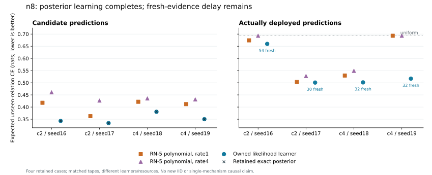

# Complete owned likelihood model matrix at n8

Status: **COMPLETE EXECUTION; FOUR SEALED AND INSTALLED CASES**. All four
registered cases execute at immutable `86083a0` under the original model,
data, resource and evidence settings. The native unit-simplex learner
realizes the known-noise adaptive posterior through owned construction,
profile, ordinary learning, AMP bridge, paired persistence and installation.
All 256 exact pre-target reference forecasts equal the independent posterior
at the same information cut. Every constructor class remains **UNRESOLVED**:
one compared v7 proposal supplies no complete-class certificate.

The earlier `90f3883` auditor failure remains separately retained and
unscored. The corrected matrix changes the independent scalar auditor, not
the production learner or its registration. This is a completed experiment
on four retained tapes, not a new IID sample, population success rate,
scaling result or complete compiler release.

## Forecasts and actual deployment

Each case constructs and selects the 338-node, 129-slot native candidate,
profiles its full training stream and predicts all 64 evaluation events.
The table reports expected CE on relations unseen during training. The
proper probabilities are reconstructed from actual stored mass words;
raw floating division scores remain separately retained and checked.

| Case | Training events | Install cursor | Fresh events before install | Remaining forecasts | Exact posterior CE | AMP candidate CE | Deployed CE |
|---|---:|---:|---:|---:|---:|---:|---:|
| c2 / seed16 | 60 | 114 | 54 | 10 | 0.342961337 | 0.342961291 | 0.659686798 |
| c2 / seed17 | 60 | 90 | 30 | 34 | 0.334027854 | 0.334027812 | 0.500749981 |
| c4 / seed18 | 40 | 72 | 32 | 32 | 0.380671383 | 0.380673430 | 0.501447073 |
| c4 / seed19 | 40 | 72 | 32 | 32 | 0.350225171 | 0.350226212 | 0.516783081 |

All four paired reference/AMP first crossings equal the actual install
cursors. They satisfy the earlier [conditional deployment envelope](../../theory/proofs/LIKELIHOOD_DEPLOYMENT_ENVELOPE.md),
which permits cursors 114-115, 90, 72 and 72. All 24 candidate, deployed and
waiting-cost envelopes pass across unseen relations and the full domain.
This comparison allows for binary64 score rounding; the envelope derivation
and wealth recurrences use exact rational bounds. The first case's actual
unseen waiting cost is 0.316725507 nats, above the proved lower bound 0.316620.
Learning the posterior removes the reference forecast mismatch, but the
registered fresh-evidence wait remains a substantial deployment cost.

The largest candidate proper-mass discrepancy from the exact posterior is
6.677962e-5, within the registered 0.001 tolerance. Tiny signed CE differences
are rounding on these tapes, not Bayes dominance. Near-neutral rounding also
changes seed16's unseen relation error from the exact control's 1/88 to the
candidate's 1/44 under the registered half-tie metric; close CE does not
erase this distinction.

## Retained strong comparisons

Both original RN-5 v5 rates and the separately executed exact/AMP adaptive
posterior controls remain in the comparison. No baseline worker was rerun.
The following are two-case means of expected unseen CE.

| Procedure | c2 candidate/predictor | c2 deployed | c4 candidate/predictor | c4 deployed |
|---|---:|---:|---:|---:|
| RN-5 v5, rate 1 | 0.390115 | 0.588589 | 0.416883 | 0.611359 |
| RN-5 v5, rate 4 | 0.443602 | 0.610303 | 0.433386 | 0.621001 |
| Owned likelihood learner | 0.338495 | 0.580218 | 0.365450 | 0.509115 |
| Retained exact posterior | 0.338495 | - | 0.365448 | - |
| Retained AMP posterior | 0.338493 | - | 0.365447 | - |

The likelihood candidate has lower CE than both retained v5 rates on every
case, and all four likelihood candidates install. This comparison changes
the native graph, Gamma, U, lowering and resource requirements together; it
does not isolate one causal mechanism. The posterior controls are separate
predictors with no FP deployment record, so no free installation is credited
to them. All original n16 v5 failures remain failed; these n8 results do not
establish their recovery.

## Complete execution and independent checks

The [source-bound journal](../../evidence/minimal/FP_LIKELIHOOD_MODEL_EXPERIMENT.json)
records all four jobs attached before resume, exiting 0 without timeout or
limit termination under the unchanged 16 GiB and two-hour caps.

| Case | Worker PID | Seal cursor | CUDA / binary64 phases each | Commit tapes | Fresh scores, both paths | Peak job bytes |
|---|---:|---:|---:|---:|---:|---:|
| c2 / seed16 | 16644 | 124 | 748 | 248 | 108 | 15,478,538,240 |
| c2 / seed17 | 10820 | 124 | 748 | 248 | 60 | 15,471,075,328 |
| c4 / seed18 | 15032 | 104 | 628 | 208 | 64 | 13,360,934,912 |
| c4 / seed19 | 17464 | 104 | 628 | 208 | 64 | 13,381,201,920 |

The workers independently replay 2,752 CUDA and 2,752 binary64 phases, 912
actual commit-operation tapes and 296 fresh scores, including full-state
installation transport. Rank-0 baseline and rank-28 candidate coordinates
stay owned. The maximum packed charge is 3,208,396,061 bytes within 8 GiB;
the largest phase uses 41,949 of 65,536 output cells and 3,544,209 of
4,194,304 evidence bytes. Each native arena is 256 MiB under the registered
512 MiB allocator cap. The largest CUDA normalization error is 1/256 and
the largest binary64 normalization error is below 1.515e-13, both within
their original tolerances. Whole-board VRAM is not process usage, exclusive
availability or a throughput measurement.

The [separate reader](LIKELIHOOD_MODEL_ANALYSIS.md), pinned at `b85b39d`,
reconstructs 24 model score records, all four paired decisions and 16
original strong-control scores, and verifies execution/registration identity.
The final [analysis record](../../evidence/minimal/FP_LIKELIHOOD_MODEL_ANALYSIS.json)
records execution and analysis sources separately. Its successful-model
branch has now checked every registered case using actual worker evidence.
The terminal journal was copied only after checking the existing prefix and
full registration equality. The parent and all four workers are terminal.

Full raw tapes remained resident through execution and independent replay.
The repository retains the small word/score/job records required for this
post-analysis, not the full tapes for another complete phase replay. Later
arena metadata and bulk readout changes on main were not used by `86083a0`
and receive no credit for these results. Deployment efficiency and useful
larger-scale execution remain open under the same semantic requirements.
