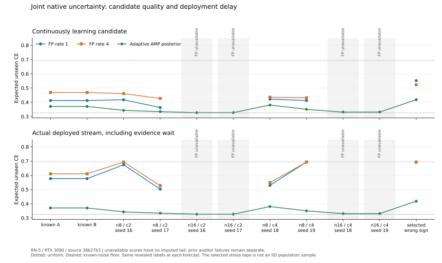

# RN-5: joint adaptation improves candidates, but leaves a posterior gap

Status: **complete registered matrix with eight failed FP attempts**.
The [journal](../../evidence/minimal/FP_JOINT_UNCERTAINTY_EXPERIMENT.json)
retains all 31 attempts at execution source
`38b27b300c22aa89ed2c458c4fbf1038a4a6b910`, with protocol origin `e3df252`.
Fourteen n8 FP streams seal, nine install, and all nine new adaptive posterior
workers complete. Four n16/c2 FP workers fail during the final independent
auditor's arena snapshot; all four n16/c4 FP workers reach their two-hour
limits. None of these eight failures supplies a model score or a complete
trajectory audit. The original budgets and failed attempts remain retained.

On the new n8 IID cases, rate 1 candidate unseen CE averages 0.390115 for
two components and 0.416883 for four, versus the adaptive AMP posterior's
0.338493 and 0.365447. Rate 4 is worse on both group means. Actual deployment
also includes long or unsuccessful fresh-evidence waits. The experiment
does not establish that transitive gradient directions recover the posterior
update, nor does it establish useful n16 execution.



## Same revealed information, separate candidate and deployment scores

The [protocol](PROTOCOL.md) registers rates 1 and 4, one-event updates and
grid 16 before the new outcomes. Every forecast precedes its actual label.
The candidate and adaptive posterior use the same revealed training and
earlier evaluation labels. The deployed stream additionally includes the
initial uniform model and the actual installation boundary.

The unseen subset excludes diagonals and both orientations of initial
training edges throughout evaluation. Earlier evaluation labels may already
inform a later query in that subset. Expected CE uses the declared noisy
relation law at each actual forecast; it is not the realized label loss.
Full-domain scores, exact-enclosed Brier, relation error and raw division
scores remain independently reconstructible from the retained journal.

| Case group | Candidate rate 1 | Candidate rate 4 | Adaptive AMP posterior | Deployed rate 1 | Deployed rate 4 |
|---|---:|---:|---:|---:|---:|
| Known A | 0.412023 | 0.468450 | 0.370531 | 0.576813 | 0.610722 |
| Known B | 0.412023 | 0.468450 | 0.370531 | 0.576813 | 0.610722 |
| n8 / c2 / seeds 16,17 | 0.390115 | 0.443602 | 0.338493 | 0.588589 | 0.610303 |
| n16 / c2 / seeds 16,17 | Failed, 0/2 scored | Failed, 0/2 scored | 0.326940 | Unavailable | Unavailable |
| n8 / c4 / seeds 18,19 | 0.416883 | 0.433386 | 0.365447 | 0.611359 | 0.621001 |
| n16 / c4 / seeds 18,19 | Failed, 0/2 scored | Failed, 0/2 scored | 0.330726 | Unavailable | Unavailable |
| Selected wrong-sign stress | 0.551847 | 0.522697 | 0.418238 | 0.693147 | 0.693147 |

IID rows are means of the two registered seeds. Every n8 attempt is scored;
all n16 attempts remain in the completion denominator. The selected stress
tape is deliberately chosen and is not an IID population sample. Its
comparator is the stated independent-fair-bit/IID posterior, not the Bayes
oracle for the tape-selection mechanism.

For the full domain, n8/c2 candidate means are 0.369795/0.406599 and deployed
means 0.575257/0.604575 at rates 1/4; the posterior mean is 0.334302. The
corresponding n8/c4 means are 0.393935/0.406343, 0.611678/0.618911 and
0.355356. The posterior completes n16 too, with full-domain means 0.326620
for c2 and 0.329844 for c4.

The known worlds reuse RN-4's controls from the journal at `3b2473a`, with
execution source `cffbadc`; no old worker is rerun. In these same worlds,
RN-4's rate 4 candidate CE was 0.440025 and deployed CE 0.495313. RN-5's
rate 1 candidate improves that candidate score, while its deployed score
worsens. The constructors, rates, range and persistence bound differ, so
this comparison does not isolate a single mechanism. The new IID seeds
also differ from RN-4's. No population guarantee or general rate ordering
follows from this matrix.

## Historical class bounds do not determine fresh deployment

Four conditioned diagnostic searches retain
`HISTORICAL_REFERENCE_CLASS_BOUNDED`. Their exact scope is historical
fixed-state empirical CE over the registered full native grammar,
initializer/profile endpoints and actual baseline at ordinary cursor 60.
This is not a certificate of the current adaptive learner's optimality,
future prediction quality or AMP class completeness. The ten other sealed
searches remain `UNRESOLVED`; failed workers have no audited final class
closure. No new `CERTIFIED_COMPLETE` scope is inferred from a sealed stream.

The independent analysis reconstructs all fourteen reference and AMP fresh
trajectories from their different actual pre-target probabilities. It checks
exact log enclosures, grid-16 lower wealth, first crossings and installation
cursors. Both paths cross at the same offsets in these nine installations;
their wealth values need not agree. The threshold is four on each path.

| n8 case | Install cursor, rate 1 | Install cursor, rate 4 |
|---|---:|---:|
| Known A | 104 | 108 |
| Known B | 104 | 108 |
| c2 / seed 16 | 116 | None |
| c2 / seed 17 | 90 | 90 |
| c4 / seed 18 | 75 | 73 |
| c4 / seed 19 | None | None |
| Selected stress / seed 20 | None | None |

Training ends at cursor 60 for the known/c2 cases and 40 for c4/stress.
Evaluation has 64 observations. No installation is forced when the finite
fresh evidence is insufficient. For example, the stress AMP wealth peaks
at 48279/16384 and 202465/65536 for rates 1 and 4, both below four, despite
candidate improvement over uniform in expected loss.

## The selected sign failure has a scoped structural explanation

The stress tape has one wrong strict training-edge majority and no ties.
The emitted graph fixes that within-component sign. The
[sign-obstruction proof](../../theory/proofs/EMPIRICAL_SIGN_OBSTRUCTION.md)
shows why adjusting its nonnegative amplitudes cannot correct the affected
internal relation. It does not show that Runtime discarded the original
labels or that the full constructor class cannot recover.

The independently computed full-domain prequential CE lower bound for this
obstruction is 0.336585. Its stronger fixed-state uniform-query bound is
0.506937. These concern different cuts: queries collected along a changing
learner cannot be treated as one fixed predictor. Neither bound is promoted
to an unseen-subset dynamic score bound. Actual stress full-domain candidate
CE is 0.550043/0.528047, versus the adaptive posterior's 0.394949.

The [scale-drift theorem](../../theory/proofs/JOINT_LEARNER_SCALE_DYNAMICS.md)
likewise separates unrounded projected dynamics from measured grid/AMP
behavior. All six completed c4/stress scale traces increase at every
cross-component update; several c2 rate 1 traces decrease on some updates.
These are descriptive observations, not a new grid/AMP monotonicity theorem.

## Execution failures, numerical evidence and retained scope

Each worker starts inside the registered 16 GiB Windows job with a two-hour
observation limit. The four c2 failures retain `MemoryError` stacks in the
final auditor's `CudaArena.snapshot()` path. The largest completed job
commitment counter is 17,180,921,856 bytes, slightly above the nominal
17,179,869,184-byte cap; do not report every counter as below the cap. No
job-limit process termination is recorded. The four c4 timeout counters
range from 8,913,358,848 to 9,627,586,560 bytes and retain exit 1223 with no
valid worker report. Neither a failed snapshot nor a missing report licenses
a score, installation or fabricated complete phase count.

For the fourteen sealed streams, independent audit checks 7,564 actual CUDA
phases and 7,564 corresponding binary64 phases. Final post-analysis checks
92 descriptive scores and fourteen fresh decisions. Nine new posterior
workers contribute 1,344 independently reconstructed GPU forecasts; the
known posterior controls remain reused evidence.

The observed CUDA maxima are state error 0.00231933594, native-mass error
0.07494939049, normalizer error 0.08432915318, probability error
0.000473596481 and division error 2.97737e-8, inside the registered distinct
tolerances. Maximum packed FP payload is 1,194,321,994 bytes; maximum native
arena extent is 3,184,784 bytes, with at most 3,589 checked output cells and
299,289 used bytes in a prepaid 2 MiB phase frame. These are measured scoped
counters, not total-host-memory or exclusive-device bounds.

The separate [earlier auditor failures](../../evidence/minimal/FP_JOINT_UNCERTAINTY_AUDITOR_FAILURE.json)
and [unreported interruption](../../evidence/minimal/FP_JOINT_UNCERTAINTY_INTERRUPTION.json)
remain linked. The latter has no invented cause or completed job counters.
All retained 31 rows were independently analyzed in the original execution
checkout with `analyze_joint.py --details --plot`, and the resulting plot
was inspected. No target rerun or budget adjustment was used to close RN-5.

After research integration, a fresh detached checkout of the original source
reproduced the entire analysis: every summary field and per-worker detail
matched exactly. Only the committed post-analysis script and final journal
were added to that checkout. Execution dependencies remained at `38b27b3`.
To reproduce from the repository root, choose an unused sibling directory:

```powershell
git worktree add --detach ../FP-rn5-audit 38b27b300c22aa89ed2c458c4fbf1038a4a6b910
@'
from pathlib import Path
import subprocess
root = Path('../FP-rn5-audit')
for name in ('experiments/joint_uncertainty/analyze_joint.py',
             'evidence/minimal/FP_JOINT_UNCERTAINTY_EXPERIMENT.json'):
    (root/name).write_bytes(subprocess.check_output(['git', 'show', '33a12e4:'+name]))
'@ | python -B
python -B ../FP-rn5-audit/experiments/joint_uncertainty/analyze_joint.py --details
```

This executes no model/GPU worker. Running the analysis against changed
execution dependencies correctly fails its source check; do not suppress
that check to analyze an old journal in a newer runtime.

The next registered pressure test is the [owned likelihood matrix](LIKELIHOOD_MODEL_PROTOCOL.md).
Its unit-simplex update can reproduce the known-model posterior exactly in
reference arithmetic, but useful n8 construction, complete execution,
physical approximation and deployment still require its own outcomes.
RN-5 does not answer those questions or require a Foundation/ERC-1 change.
