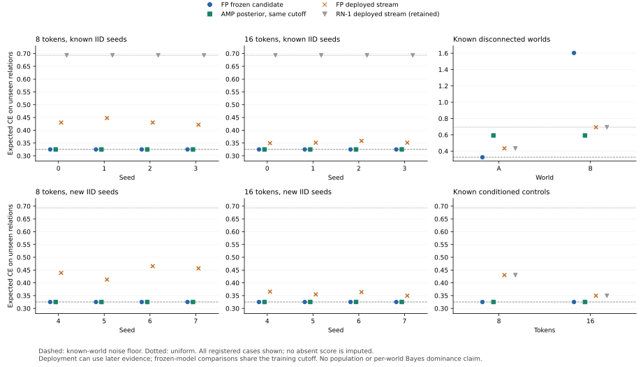

# RN-2: prospective models and unresolved optimization

Status: **completed registered experiment; scoped empirical result**.
The [protocol](PROTOCOL.md) was committed at `9ec4c33`; the
[runner](run.py) was committed at
`5bcbb49665f5c1222127c50a5d399628377c0a3d` before target execution.
The [journal](../../evidence/minimal/FP_PROSPECTIVE_RELATION_EXPERIMENT.json)
contains all 28 new workers at that source, with no execution failure or
parameter change. All twenty FP streams seal on actual CUDA. Nineteen
install; the disconnected world B retains its finite `EVIDENCE` outcome
without installation. There is no new continuation authority at a sealed end.

The change recovers all eight known IID failures and constructs and installs
models on all eight preregistered new IID samples. All sixteen IID training
classes remain `UNRESOLVED`, without a class-maximum proof. The four
conditioned/disconnected diagnostics retain their actually attained
historical categorical bounds. Successful deployment is not relabeled as
optimization completeness or population identification.

## What changed

[RN-1](../relation_noise/RESULTS.md) exposed two independent restrictions.
Its relation proposer demanded that an unrestricted empirical fit equal an
initialized value. Its installation strategy demanded a historical training
maximum even though the fresh-evidence theorem has no such premise.

The [v2 extension](../../theory/proofs/OWNED_PROSPECTIVE_SELECTION.md) removes
both restrictions. It selects a readout scale by exact likelihood among the
same available `(1,8)` values and admits an actually compared improving
candidate to new paired evidence. Its full native grammar, baseline,
unvisited alternatives, numerical checks and resource contract are retained.
Installation still transfers the continuously tested current learner, after
independent reference and actual CUDA crossings. No optional historical
proof can substitute for those current conditions.

This experiment separates three questions: whether a useful candidate was
constructed, whether the actual deployed stream improves after fresh
installation, and whether the full training-optimization class was solved.
The first two can succeed while the third remains `UNRESOLVED`.

## Measured model behavior

Every IID sample has correct strict edge majorities. Each actually constructed
program chooses the initialized scale8 and has `(2n+10, 6, 4, 2n+12, 2)`
nodes/SUMs/PRODUCTs/edges/slots. On unseen relations each connected candidate
has exact expected Brier `9/50`, zero latent-relation errors and CE
`H(1/10) = 0.325082973391448` up to binary64 accumulation. The eight new
seeds support this finite-sample observation; they do not supply a population
recovery guarantee.

The following CE entries are means over the four fixed seeds in each row.
Candidate and posterior columns use the same training cutoff. The deployed
column includes later evidence and the initial uniform deployment.

| Split | n | Seeds | Installs | Frozen FP candidate | AMP posterior | FP deployed stream |
|---|---:|---|---:|---:|---:|---:|
| Known diagnostic | 8 | 0--3 | 4/4 | 0.325083 | 0.325083 | 0.432435 |
| Known diagnostic | 16 | 0--3 | 4/4 | 0.325083 | 0.325115 | 0.352688 |
| New sample | 8 | 4--7 | 4/4 | 0.325083 | 0.325083 | 0.443389 |
| New sample | 16 | 4--7 | 4/4 | 0.325083 | 0.325247 | 0.358384 |

RN-1 constructed no candidate on the first two rows and deployed uniform CE
`log(2) = 0.693147180559945`. The v2 result therefore removes an observed
solver/strategy bottleneck. The strong posterior remains near the known-world
noise floor: on new n=16 samples its CE ranges from 0.325083116 to 0.325378475.
The small difference from the hard candidate is not a Bayes-dominance claim.

All n=8 IID installs occur at cursor90, twenty fresh events after training.
Known n=16 seeds and new seeds5/7 install at cursor170; new seeds4/6 install
at cursor180. Exact dyadic-wealth replay reproduces these additional ten
events of waiting. The mean full-domain deployed CE is 0.440103 at n=8 in
both splits, and 0.353838/0.361027 for known/new n=16 samples. Differences
between full-domain and unseen-only losses reflect which contexts arrive
before installation; no candidate loss is substituted for deployed loss.

Both conditioned controls retain their old successful behavior. The
disconnected counterexample also survives unchanged:

| Identical disconnected training | Frozen FP candidate CE | AMP posterior CE | Deployed CE | Install cursor |
|---|---:|---:|---:|---:|
| World A | 0.325083 | 0.592766 | 0.433829 | 80 |
| World B | 1.603468 | 0.592766 | 0.693147 | None |

The equally weighted frozen-candidate excess over the posterior remains
`(8/11) log(5/3) = 0.3715095445570845`. Valid fresh installation and
historical training optimality do not eliminate this missing uncertainty.
World B's finite no-install outcome is not a statistical rejection.

## Fixed comparison

Twenty FP workers cover twelve known diagnostics and eight previously
unexecuted IID seeds. Eight additional fresh workers execute the strong AMP
forest posterior on the new seeds. The diagnostic posterior measurements
are reused from RN-1's canonical journal at `4d04595`, retaining original
worker source `5b050c7`. Their counts, build/device identity and all 64 RN-1
score records are independently checked before reuse. They are never
relabeled as new GPU executions.

Frozen-candidate and posterior scores use the same revealed training cut.
Unseen relations exclude the diagonal and both orientations of every trained
edge. CE is descriptive binary64 expected loss under the realized world's
known label probabilities, computed from normalized retained AMP masses;
the journal separately retains raw single-division CE, exact expected Brier,
probability gaps and classification errors. Hidden bits enter scoring only.

FP full-domain scores are also retained. The analyzer can rescore full-domain
posterior predictions from the pipeline whose every n-squared actual output
was checked by the original worker. That rescore is not a new GPU execution.
Deployment scores include the initial uniform predictions and can use later
fresh observations through the registered installation decision. They must
not replace the comparison between frozen models at a common information cut.

## Interpretation that does not depend on the sampled outcome

A correctly recovered hard relation with scale8 predicts the realized-world
noise floor, but that does not establish a better conditional predictor than
the posterior. For one context, let `q = P(Y=1 | revealed training, context)`
under the registered prior/noise law, and let `p` be a fixed candidate's
probability. Subtracting the two conditional expected log losses gives

`q log(q/p) + (1-q) log((1-q)/(1-p))`.

This is nonnegative and is zero only when `p=q`. Finite IID edge observations
generally retain uncertainty, while the hard constructor commits to one
relation sign. A small realized sample can favor that sign and give lower
known-world CE than the posterior without reversing the conditional expected
ordering. No population success rate or per-world Bayes dominance follows.

The disconnected diagnostic makes this distinction observable without
sampling a large population. Its two worlds have identical training and
opposite unobserved cross-component relations. A training-optimal hard
assignment can conceal that uncertainty. Neither dropping the historical
maximum prerequisite nor obtaining a legitimate fresh installation proves
that the remaining unobserved relations were identified.

## Reproduction and evidence scope

`python -B experiments/prospective_relation/analyze.py` independently
recomputes recorded scores, checks exact initialized likelihood choices and
the full optimization decisions, and validates source/job/device/resource
identities. `--partial` inspects only already completed cases; `--plot`
renders the final standalone figure after the complete matrix exists.
It never reruns a model worker.

The analysis also replays the model-specific prospective decision. Actual
normalized reference/CUDA masses agree at these zero-rate integer endpoints.
For each path's bound3 and bet3/4 rule, the update factor is
`1 + lower_log_gain/4`, followed by a floor to the 2^-16 wealth grid.
The analyzer checks the registered log interval against a 100-digit Decimal
calculation and recomputes dyadic wealth independently of Runtime's update.
At its first crossing the identity stops betting; the learners still
continue to the next complete optimizer boundary. This distinguishes a
legitimate waiting cost from missing construction or a failed certificate.
It is a check of the recorded finite tapes, not a power theorem or proof
that seeded observations satisfy a conditional stochastic null.

The experiment uses the same RTX 3090 path, 16 MiB arena, 32 MiB native
reservation cap, 1 GiB packed cap and 4 GiB job fence as RN-1. Complete host
commitment, consumed native extent, tensor allocation and the 24 GiB physical
board envelope are different quantities. No process-VRAM optimum, exclusive
device availability or throughput advantage is inferred from them.

The 20 FP workers independently replay 17,064 CUDA and 17,064 binary64
phases. The eight new baseline workers check 1,280 actual GPU forecasts.
Post-analysis recomputes 96 new score records and all twenty prospective
decisions, in addition to the 64 retained RN-1 scores. Maximum observed
packed payload is 198,042,162 bytes; consumed native arena extent is 898,200
bytes. At most 239 output cells and 17,365 bytes per phase frame are observed,
within the fixed 4,096-cell/131,072-byte limits. Maximum completed job commitment
is 2,992,779,264 bytes, below 4 GiB.

The new posterior workers have exact output-probability numerators and
denominators of at most 352 bits, a 1,024-byte half table, 11,264-byte tensor
peak and 2,097,152-byte
native reservation peak. Their maximum normalized-mass AMP error is
`70532950049/1804805148268354`, about 3.908e-5. The device is RTX 3090 SM8.6,
UUID `GPU-229f6784-2b41-5313-3f21-e30f26b0bf5c`, driver616.92, runtime/API13.4,
with Torch2.12.0+cu132 (build CUDA13.2). Device identity, host commitment and
reference payload accounting are retained separately.

The journal is about 131 KB and the standalone SVG about 86 KB. No model
weights, dataset, full phase histories or duplicate RN-1 journal are retained.

Foundation R4, XVII.31 and ERC-1 remain frozen. The old complete release at
`5e55eb4` and RN-1 keep their original tested scopes; this experiment uses
the separately audited prospective extension.

The scoped RN-1 construction/installation obstruction is now closed by an
executed strategy and independent new-seed evidence. The active research
problem is representing and using uncertainty about unobserved relations
within native reachable value paths. Preserve comparisons at equal
information cuts: improving a frozen uncertain predictor and improving an
adaptive deployed stream are distinct objectives. This result does not call
for more static resource special cases or a new semantic architecture action.
