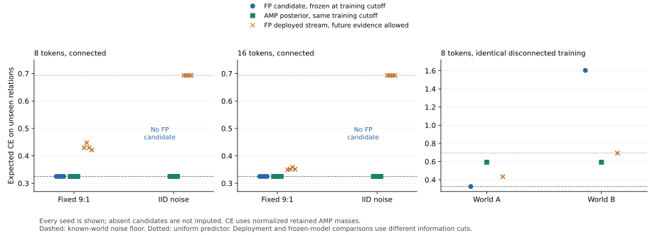

# RN-1: the frozen solver succeeds on fixed proportions and stalls under IID noise

Status: **completed preregistered RTX 3090 experiment; scoped negative model
result and exact algorithm diagnosis**. All 18 cases and both implemented
paths ran at source `5b050c7`: 36 fresh fenced workers, with no parameter,
budget, code or reporting correction during execution. The
[protocol](PROTOCOL.md) and [gate lemma](GATE_ELIGIBILITY.md) precede execution.
Foundation R4, ERC-1 and the frozen Runtime are unchanged.

The principal result is an inference/selection mismatch. All eight IID
training samples contain correct strict majorities on every observed edge,
and the strong AMP posterior predicts unseen relations near the known-world
noise floor. The current FP solver nevertheless constructs **no candidate**
in any IID case. Successful execution of the conditioned release fixture
does not establish robust ordinary-data proposal/selection.



## 1. Main comparisons

CE below averages over previously unobserved relations, excluding diagonals
and both orientations of every training edge. Each main row averages all
four preregistered seeds. There are 42 scored contexts per n=8 case and 210
per n=16 case. These are descriptive finite experiments, not seed-based
population confidence intervals.

| Tokens | Training law | FP candidate CE at training cutoff | AMP posterior CE at same cutoff | FP deployed-stream CE | Installs |
|---|---|---:|---:|---:|---:|
| 8 | Exactly one flip per ten labels | 0.325082973 | 0.325082973 | 0.432435034 | 4/4 |
| 8 | IID flip probability 1/10 | No candidate | 0.325082998 | 0.693147181 | 0/4 |
| 16 | Exactly one flip per ten labels | 0.325082973 | 0.325082973 | 0.352687789 | 4/4 |
| 16 | IID flip probability 1/10 | No candidate | 0.325115359 | 0.693147181 | 0/4 |

The known-world noise floor is `H(1/10)=0.325082973391448...`; uniform CE
is `log(2)=0.693147180559945...`. In conditioned connected cases the actual
retained candidate masses represent the true 9/10 versus 1/10 probabilities
exactly. Its exact expected Brier score is 9/50. All eight install twenty
observations after training, at ordinary cursor 90 or 170.

The frozen candidate and posterior use the **same training cutoff**. The
deployed-stream column is a different policy diagnostic: Runtime observes
future labels for fresh comparison and initially predicts uniformly until
installation. Its loss cannot be replaced with the final candidate's loss.
No unbuilt IID candidate receives a counterfactual score in the experiment.

The IID AMP posterior CE ranges are 0.325082982--0.325083044 at n=8 and
0.325082982--0.325212273 at n=16. Every IID baseline has zero latent-relation
classification error in these seeds. Its uncertainty still depends on the
data: the final n=16 seed has a 6:4 edge split, whereas several other edges
are unanimous. The baseline uses the declared independent-bit prior and
the correct training law; it receives no hidden bits. Its exact CPU value
constructor and AMP table realization are explicitly different from FP's
local `(1,8)` initializer. This is a strong statistical control, not a
competitor inside the certified FP constructor class.

Scores in the table use mathematically normalized actual retained AMP
masses. Independently checked raw single-division scores are retained
separately. For the conditioned exact candidate, the latter CE is
0.32508299574319..., rather than the exact normalized-mass value. The
largest posterior AMP probability error relative to its exact CPU posterior
is `70532950049/1804805148268354`, about 3.91e-5. This precision effect does
not explain FP's absent IID candidates or uniform deployment.

## 2. Identify the obstruction without granting a false certificate

Every IID run reports the same proposal reason:

> the empirical construction needs values absent from the registered initializer

The current solver fits a common empirical readout scale and emits native
syntax only if that scale already occurs in `(1,8)`. The eight fitted scales
are `23/6, 27/4, 31/2, 33, 116/17, 124/13, 44/3, 11/2`. None occurs in
the initializer. All eight sessions remain `UNRESOLVED`, compare zero
constructed candidates, issue zero reference proofs and spend zero alpha.
The ordinary Runtime streams still finish normally.

An explicitly **post hoc exact diagnostic** compares the two already
available readout values without constructing a new Runtime learner. Let
M and m be pooled majority and minority counts. Scale8 has likelihood
`9^M/10^(M+m)`, scale1 has `2^M/3^(M+m)`, and uniform has `1/2^(M+m)`.
Integer cross-products show scale8 beats both alternatives on all eight
samples. Thus exact matching of the unrestricted fitted scale is an
unnecessary condition for proposing a useful reachable value. This check
confers no construction, forecast, persistence or installation authority.

There is a second, distinct gate. Even if such a native candidate were
constructed, the current owned policy and installation port require a
completed reference-class selection before using/installing the proposal.
The [preregistered lemma](GATE_ELIGIBILITY.md) proves that the existing
uniform/proposal endpoints attain their all-categorical empirical upper
only through all 5:5 or all 9:1 edge splits. Under IID noise, arithmetic
eligibility is `p9^(n-1)+p5^(n-1)`: approximately 6.65e-7 at n=16, despite
correct strict-majority recovery probability above 0.975. This necessary
arithmetic condition is neither a full native-class impossibility nor an
installation probability. Resource, numerical and fresh-evidence failures
can only further restrict actual success.

The ten actual `REFERENCE_CLASS_BOUNDED` results have one exact decision
class: the registered finite ordered native grammar's initializer/profile
endpoints plus the actual deployed baseline, scored by fixed-state empirical
CE on logged contexts. An actually built witness attains the independently
checked categorical upper. The unvisited grammar is not claimed to have
been executed. There is no `CERTIFIED_COMPLETE`, all-value optimum,
population-optimality or PRODUCT-forcing result.

## 3. Indistinguishable training can conceal very different model quality

The two n=8 disconnected cases have identical training observations and
the same constructed candidate, but opposite cross-component relations.
Their unseen set contains twelve within-component and 32 cross-component
ordered pairs. The independent posterior correctly leaves cross-component
probabilities at 1/2.

| Identical-training world | FP frozen candidate CE | AMP posterior CE | FP deployed-stream CE | Installation |
|---|---:|---:|---:|---|
| A | 0.325082973 | 0.592766033 | 0.433829216 | Cursor 80 |
| B | 1.603468182 | 0.592766033 | 0.693147181 | None in this run |

Both candidates attain the same training upper. They cannot both identify
the unknown relative component flip. Averaging the frozen candidate over
these two equally weighted worlds gives CE 0.964275578, exceeding the AMP
posterior by `(8/11) log(5/3)=0.371509545...`. This is the cost of a hard
unidentified component choice in this control, not a new static resource law.
The posterior need not beat that hard choice in every individual world:
world A is the favorable guess. Its optimality is conditional prior-averaged
expected CE, not a per-world ordering guarantee.

World B retains policy stage `EVIDENCE` at the final sealed boundary and
has no installation receipt. This is a completed finite stream with an
unfinished deployment/evidence outcome, not an authorized continuation
after sealing or a statistical rejection certificate. The experiment does
not claim that fresh persistence always detects a bad population model.

## 4. Execution, resources and retained evidence

All 18 FP streams seal. Ten searches are reference-class bounded and eight
remain unresolved. There are nine actual installations. The workers replay
12,564 complete CUDA phases independently with exact encoded arithmetic and
12,564 binary64 phases with the separate float64 oracle. The 18 baseline
workers check every raw value in 2,688 actual full-domain GPU forecasts.
The post-analysis independently recomputes 64 score records, with exact
Brier, probability-gap and latent-error equalities alongside binary64 CE.

| Resource observation | Maximum |
|---|---:|
| FP packed payload peak | 198,026,591 bytes |
| FP consumed native arena extent | 898,200 bytes |
| Baseline materialized half table | 1,024 bytes |
| Baseline measured native tensor peak | 11,264 bytes |
| Baseline measured native allocator reservation | 2,097,152 bytes |
| Completed worker Windows job commitment | 2,989,924,352 bytes |

Every worker is fenced before entry by its registered 4 GiB job limit.
FP's arena remains a fixed 16 MiB allocation; the bound to the actual board
remains 24 GiB for both paths. Consumed extents, table payload, allocator
reservation, host commitment and whole-board envelope are different
quantities. FP runs an entire compiler, continuous shadows and evidence
history; the control runs its declared frozen posterior pipeline. These
measurements do not establish an architecture memory advantage or speedup.

The compact [result journal](../../evidence/minimal/FP_RELATION_NOISE_EXPERIMENT.json)
is 125,451 bytes. No weights, datasets or full phase logs are retained.
All workers retain their original source and actual device/job identity.
The target is the frozen RTX 3090, Torch 2.12.0+cu132, actual CUDA runtime
API 13040 and driver 616.92. PRNG tapes are reproducible finite evidence;
they do not prove an ideal independence premise or a cross-root error bound.

Recompute the analysis and standalone figure without a GPU run:

```
python -B experiments/relation_noise/analyze_results.py --plot
```

The 121 count-pattern and 40 posterior-enumeration checks are preregistered
algorithm audits. Full target phase checks ran once per registered worker;
post-analysis does not pretend that a compact journal contains those full
device trajectories.

## 5. The research consequence

The existing release remains a correct scoped implementation, but its
particular proposal/selection strategy is inadequate for this IID task.
Fixing the proposal's discrete value choice alone leaves the categorical
upper gate. Tightening an empirical upper alone does not identify unknown
relations, as the disconnected control demonstrates.

Foundation XIV's fresh e-process requires a predictable, continuously
identified candidate and valid bounded same-path gains; its validity does
not require that candidate to maximize a past training objective. XVIII
requires honest class-completion status, ownership, registered value paths,
fresh evidence and current-state installation. The existing implementation
chooses the stronger historical training-maximum prerequisite. The next
solver/strategy work should separate these claims while retaining every
current construction, resource, lineage, bridge and transport obligation.
An unresolved full class must stay unresolved even when a tested candidate
can proceed through a separately justified prospective decision.

This is not permission to narrow the decision class to the chosen graph,
reuse proposal labels as fresh evidence, accept caller-supplied authority,
inject fitted constants or add a semantic architecture action. Any expanded
Runtime strategy needs its own actual endpoint evidence; the old frozen
release cannot certify an unexecuted extension. No Foundation counterexample
or reason to restart the parked static resource study was found.
